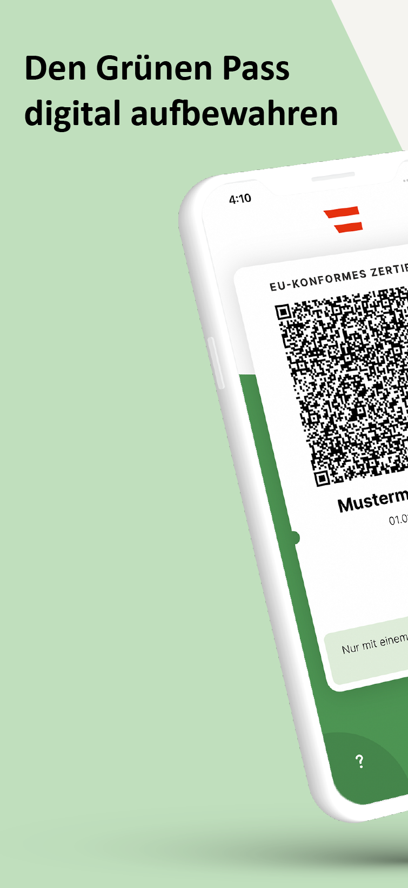
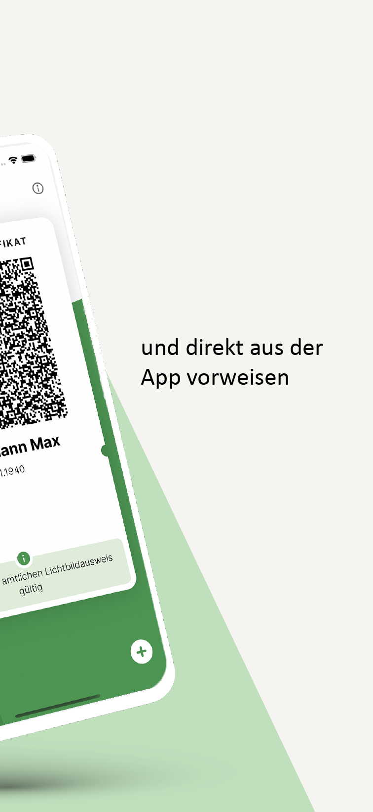
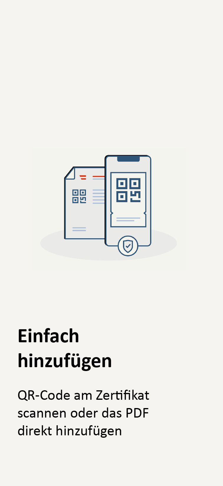
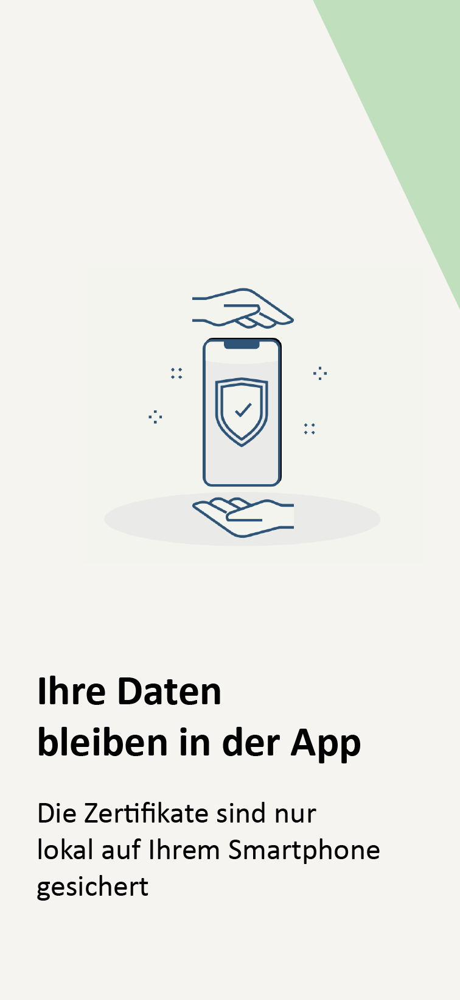

# Grüner Pass App - iOS

[](https://github.com/BRZ-GmbH/CovidCertificate-App-iOS/blob/main/LICENSE)

Dieses Projekt wurde veröffentlicht durch [Bundesrechenzentrum GmbH](https://www.brz.gv.at/).
Es basiert auf auf der OpenSource-App des [Schweizer Bundesamt für Information und Telekommunikation (BIT)](https://github.com/admin-ch/CovidCertificate-App-iOS)

## Grüner Pass App

Der Grüne Pass ist die offizielle App des Bundesministeriums für Soziales, Gesundheit, Pflege und Konsumentenschutz (BMSGPK) zum Verwahren und Vorzeigen von EU-konformen Covid-19-Zertifikaten aus Österreich. Geladene Zertifikate werden ausschließlich lokal gespeichert.

<p>
<a href='https://apps.apple.com/at/app/grüner-pass/id1574155774'>

</a>
</p>

<p align="center">




</p>


## Beiträge zur Weiterentwicklung der App

Dieses Projekt ist als OpenSource-Projekt gestaltet. Feedback zum Quellcode nehmen wir gerne entgegen.
Bugs oder Probleme sollten als Github issues gemeldet werden. Diese App steht in deutscher Sprache zur Verfügung.

## Repositories

* Android App: [CovidCertificate-App-Android](https://github.com/BRZ-GmbH/CovidCertificate-App-Android)
* Android SDK: [CovidCertificate-SDK-Android](https://github.com/BRZ-GmbH/CovidCertificate-SDK-Android)
* iOS App: [CovidCertificate-App-iOS](https://github.com/BRZ-GmbH/CovidCertificate-App-iOS)
* iOS SDK: [CovidCertificate-SDK-iOS](https://github.com/BRZ-GmbH/CovidCertificate-SDK-iOS)

## Installation and Building

Das Projekt sollte mit Xcode 12.5 oder einer neueren Version geöffnet werden.
Abhängigkeiten werden mit [Swift Package Manager](https://swift.org/package-manager) verwaltet, kein weiteres Setup benötigt.

###Zusätzliche Build Hinweise
Folgende Konfiguration muss in der Build-/Entwicklungsumgebung sichergestellt sein, damit Vertrauenslisten, Geschäftsregeln und weitere Informationen vom Service abgerufen werden können. Weitere Informationen können auch unter https://github.com/Federal-Ministry-of-Health-AT/green-pass-overview#getting-access-to-trust-list-business-rules-and-value-sets nachgelesen werden.

Hierfür ist lokal eine Datei "Config.xcconfig" mit folgenden Inhalt anzulegen:

 ```
 WALLET_APP_SDK_API_TOKEN = <SETZEN SIE HIER IHREN TOKEN JE NACH GEWÜNSCHTER UMGEBUNG EIN>
 ```

## Lizenz

Dieses Projekt ist lizenziert unter den Bestimmungen der MPL 2 license. Siehe [LICENSE](LICENSE) für Details.
